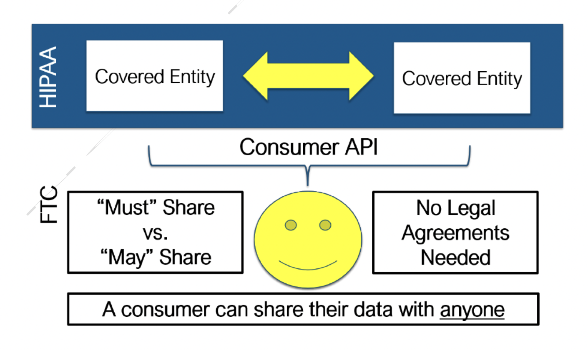

# Patient Access

## What is patient access?


There are ways for patients to access their data through APIs. Today, nearly 100 million US patients can share their data with application developers. ****[**Automate Medical**](https://www.automatemedical.com/), ****authors of the Sero toolkit, ****can help you get access.


Patient access is the ability for patients to access their own health data. As electronic health records have evolved, so too have the ways and means for patients to access them.

Today, there are new patient access standards that enable app developers and startups to build experiences around patient health records without needing to seek the permission of anyone but the patient.

For nearly 100 million US patients, it's now possible to build applications that:

* Allow users to synchronize their health records with your app
* Automatically identify unused health insurance benefits
* Provide personalized health feedback and opportunities
* Improve the quality of care and outcomes for patient by "killing the fax"

This is possible because the [21st Century Cures Act](https://en.wikipedia.org/wiki/21st_Century_Cures_Act) \(2016\) and [**Interoperability and Patient Access final rule** \(CMS-9115-F\)](https://www.cms.gov/Regulations-and-Guidance/Guidance/Interoperability/index) ****set the foundation for adoption of an open patient access framework.

The Patient Access final rule specifically mandates the use of FHIR, SMART, and USCDI \(technical standards we will discuss below\) by CMS-contract payers like Humana, Aetna, and Optum. **As of July 1, 2021, we are now in the enforcement period for having Patient Access APIs** available:

> As of July 1, 2021, two of the policies from the May 2020 Interoperability and Patient Access final rule are now in effect... On July 1, 2021, CMS began to enforce requirements for certain payers to support Patient Access

### Opportunity

As of July 1, 2021:

* ~100 million beneficiares in CMS programs, and growing - all of these patients have the ability to allow you to access their health data from their plan administrator \("payer"\)
* Uses an authorization and identity model familiar to developers \(SMART, which is discussed below, is a OAuth 2.0 variant
* Anti-blocking rules and industry bodies like the [CARIN Alliance](https://www.carinalliance.com) have developed strong rights of access for developers. In general, as long as you are a "processable entity", you can register your application with a payer's Patient Access API without needing any further permission.
* Additionally, [CARIN Code of Conduct contains statements ](https://www.carinalliance.com/wp-content/uploads/2020/07/2020_CARIN_Code_of_Conduct_May-2020.pdf)re: apps using consumer directed-access. These apps do not fall under the scope of HIPAA covered entities - instead they fall under the scope of the FTC - a potential major source of reduction in "time to launch"

### Technical Standards

We will cover these in greater detail below, but as a summary reference point the following standards are the foundation for Patient Access:

* [FHIR](fhir.md#what-is-fhir)
* [SMART/OAuth 2.0](http://hl7.org/fhir/smart-app-launch/)
* [United States Core Data for Interoperability \(USCDI\)](https://www.healthit.gov/isa/united-states-core-data-interoperability-uscdi)

## How does patient acccess work?


The remainder of this page is a work in progress.


* CARIN BB 2.0
* Payer data

### FHIR + SMART Authorization \(OAuth 2.0\)

## Relevance

1. The specific 

