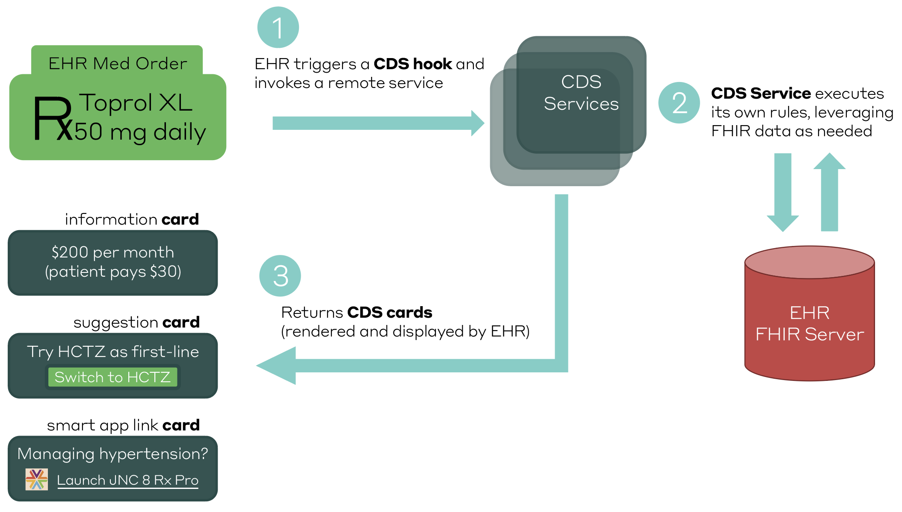

# Decision Support APIs

## What is a decision support API?

A decision support API supports an existing health care workflow such as prescribing medication, by providing contextually relevant information, automation, and guidelines related to that workflow via a standardized API. 

With decision support APIs we can build examples like:

* [Automating the identification of high risk medication order requests](http://build.fhir.org/ig/cqframework/opioid-cds/) via the CDC Guideline for Prescribing Opioids for Chronic Pain
* * 
According to Dr. Joe Kimura, Chief Medical Officer at Atrius Health:

> The amount of information we need to understand is getting so untenable that it’s unreasonable to expect the average clinician to integrate all of it into their decision-making effectively and reliably

## How do decision support APIs work?

### CDS Hooks

### Discovery

### Requesting\

## Relevant 

