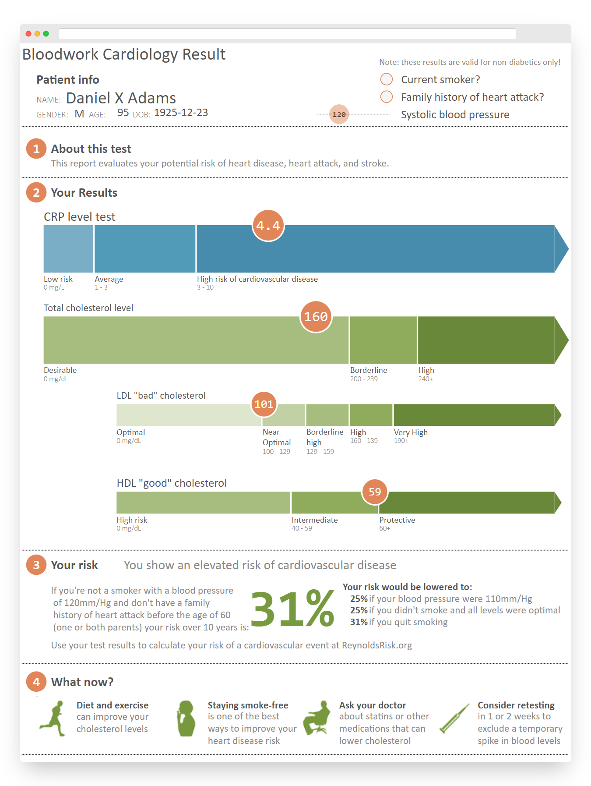
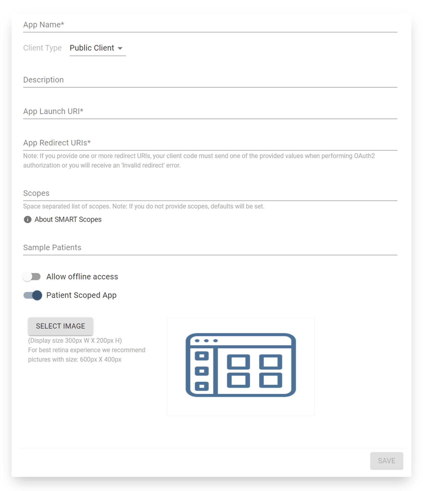
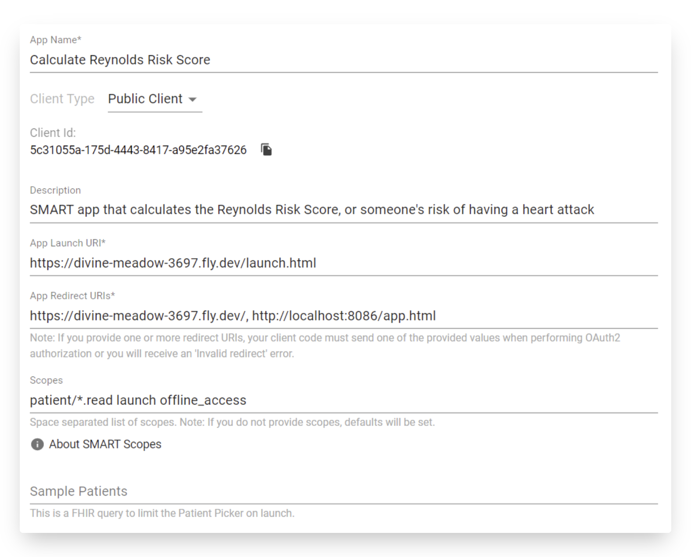
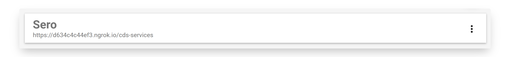
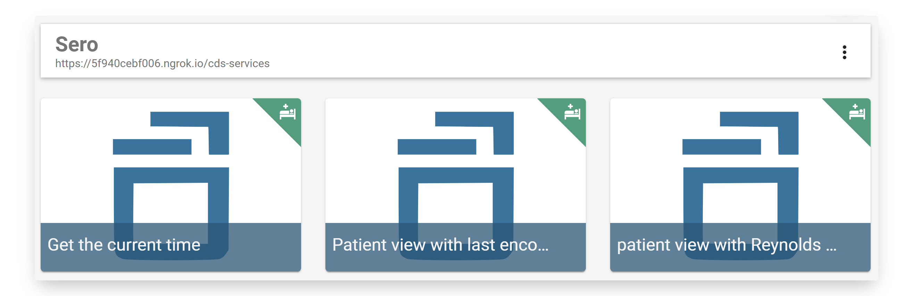
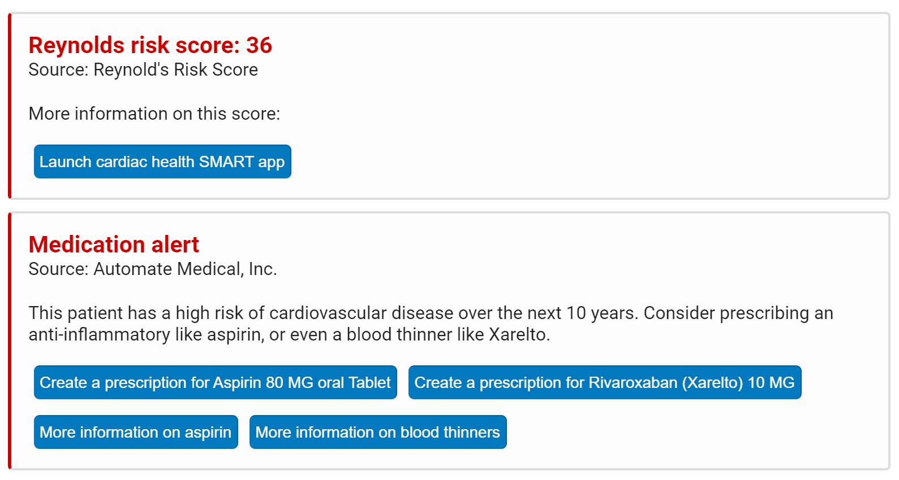
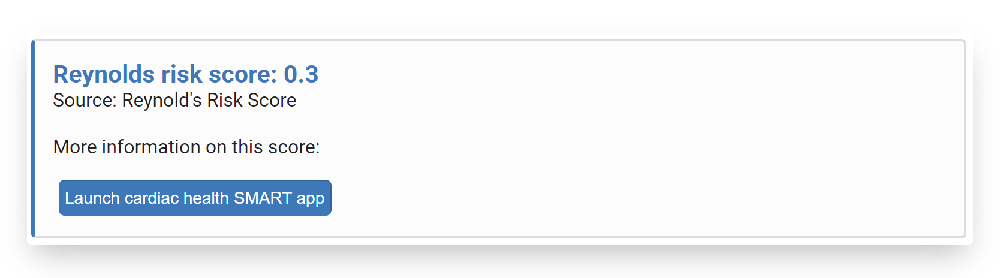
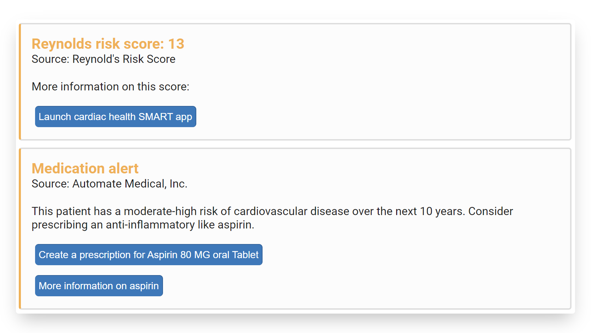

# Links, Suggestions, and SMART apps

## What we'll be building

In this section, we'll be building a CDS service that calculates the [Reynolds Risk score](http://www.reynoldsriskscore.org/) of a patient based on recent clinical observations. Based on the calculation, the service will return a suggestion that suggests the patient be prescribed a medication to manage their high risk. A link to more information about the medication, and a link to a SMART app to further work with the information will be provided as well. 

This service will also be invoked with the `patient-view` hook. 


You can find the complete source for this guide in the Sero project at [**example/cds-hooks-api-guide**](https://github.com/Automate-Medical/sero/tree/master/example/cds-hooks-api-guide)


## Suggestions and links

We'll first take a closer look at the [attributes](https://cds-hooks.hl7.org/1.0/#card-attributes) of a `Card` from the CDS Hooks specification. There are attributes of cards that can enhance a service's decision support that we haven't worked with yet. Two of those attributes are **suggestions** and **links.** 


### Suggestions and actions 

If we wanted to provide more interactive decision support, such as suggesting that a user read further into an issue, or even prescribe a medication, we'd use **suggestions**.

Suggestions are described by three attributes. Only the `label`property - a human-readable description of the action taken by "taking" a suggestion - is required. The following is an example of a suggestion with the `label` and `actions` properties. The `action` is a `MedicationRequest` `POST` request. 

```javascript
suggestions: [
  {
    label: "Create a prescription for Aspirin 80 MG oral Tablet",
    actions: [
      {
        type: "create",
        description:
          "Create a prescription for Aspirin 80 MG Oral Tablet",
        resource: {
          ...
          // shortened for brevity
          ...
        },
      },
    ],
    request: {
      method: "POST",
      url: "MedicationRequest",
    },
  },
],
```

**Actions** are actions that the user of the CDS client take when given a suggestion. In an interface that renders CDS cards, like Logica, actions will look like a button that, when pressed, will perform one of the three types of actions: `create`, `update`, and `delete`. If the type of action is `create` or `update`, the action must include the `resource` field that's populated by a FHIR resource to be provided so that the action can be taken. 

### Links

If we wanted to provide links to external SMART apps or web pages, we would use **links**. 

Links come in two varieties. `absolute` links take the user to an external website, such as a reference page or a paper. `smart` links are used to launch external SMART applications. SMART applications are healthcare applications designed to use the [SMART on FHIR API](https://smarthealthit.org/about-smart-2/). Think of them as healthcare applications that we can launch from a `Card` when we need enhanced functionality to deal with present FHIR data.

Below is an example of an `absolute` link to [google.com](https://www.google.com).

```javascript
links: [
  {
    label: "Google.com",
    url: "https://google.com",
    type: "absolute",
  },
],
```

Below is an example of a `smart` link to an external SMART app.

```javascript
links: [
  {
    label: "Launch the CarePassport patient portal",
    url: "https://carepassport.net/FHIR/launch.html",
    type: "smart",
  },
],
```

## SMART applications

### Reynolds risk score

As opposed to the previous two sections, the service we'll build in this section is tailor-made to provide useful decision support for a real-world issue. 

The [**Reynolds Risk Score**](http://www.reynoldsriskscore.org/) is a metric designed to predict someone's risk of having a future heart attack, stroke, or other major heart disease within the next 10 years. It uses different patient observations to make its assessment, including smoking status, systolic blood pressure, and cholesterol levels. 

The service we'll build will calculate this risk score based on the most recent patient observations. By some metric, the service will make suggestions to prescribe certain medications if the patients risk is high. Finally, the service will provide a link to a SMART app to further work with the support information that your service provided.

### What is a SMART app?

A SMART app is a new class of healthcare application that's designed to be used in healthcare settings that fit the requirements laid out by [SMART on FHIR](https://docs.smarthealthit.org/) - an open healthcare API. In this example, we are going to register a SMART app called [_Cardiac Risk_](https://apps.smarthealthit.org/app/cardiac-risk)_._ Although the service that we create will also calculate a patients risk score, The _Cardiac Risk_ application will provide _enhanced_ support, such as helpful visualizations, and interventions that could decrease the patient's score. 

The version of Cardiac Risk that we'll be using we've modified to work with the latest version of FHIR \(you can find the code [here](https://github.com/Automate-Medical/cardiac-risk-app/tree/feature/fly-hosting)\).



## The code

### Imports

In the `src` directory, create a folder called `suggestions-links-fhir`. `cd` into it and create a file called `prefetch-context.js`. You'll be using the `Service` and `Card` classes like in the prior two sections.


```javascript
import { Service, Card } from "@sero.run/sero";
```


### Options

This service is invoked on the `patient-view` hook like the previous two sections. Like the previous section, we'll use a prefetch template that fetches relevant information needed to determine the Reynolds risk score. 


```javascript
const options = {
  id: "suggestions-links",
  title: "patient view with Reynolds Risk Score assessment",
  hook: "patient-view",
  description:
    "Service triggered on the patient-view hook that calculates Reynolds risk score, and makes a MedicationPrescribe suggestion based on the result. Also provides a link to a SMART app to help work with the result",
  prefetch: {
    patient: "Patient/{{context.patientId}}",
    hscrp: "Observation?code=http://loinc.org|30522-7&_sort=date",
    cholesterolMassOverVolume:
      "Observation?code=http://loinc.org|2093-3&_sort=date",
    hdl: "Observation?code=http://loinc.org|2085-9&_sort=date",
    bloodPressure: "Observation?code=http://loinc.org|55284-4&_sort=date",
    smokingStatus: "Observation?code=http://loinc.org|72166-2&_sort=date",
  },
};
```


The prefetch template includes four FHIR path search queries for observations matching the loinc code in the search query. For example, to fetch all of the Observations where the patients blood pressure was measured, and sort by date, you'd use `Observation?code=http://loinc.org|55284-4&_sort=date`. 

This will return a `Patient` and five`Bundle` FHIR resources.

### Helper functions

To calculate the risk score, we'll be using the following two formulas. This is because the calculation differs by gender.

![Reynolds Risk Score for women \[1\]](../../../.gitbook/assets/ayy_reynolds-1-.png)

![Reynolds Risk Score for men \[2\]](../../../.gitbook/assets/reynolds_men.png)

Like the prior section, create `util.js` and copy in the following code. 


```javascript
/**
 *
 * @param {*} patient - patient FHIR object
 * @param {number} age - the patients age
 * @param {number} hscrp - hscrp value
 * @param {number} cholesterol - cholesterol value
 * @param {number} hdlc - hdlc value
 * @param {number} systolicBloodPressure - systolic blood pressure
 * @returns {[number, string]} reynolds risk score - 10-year cardiovascular disease risk
 */
export function reynoldsRiskScore(
  age,
  gender,
  systolicBloodPressure,
  hscrp,
  cholesterol,
  hdlc,
  smoking = false
) {
  // parameter coefficients based on gender
  const params =
    gender == "female"
      ? {
          age: 0.0799,
          systolic: 3.137,
          hscrp: 0.18,
          cholesterol: 1.382,
          hdlc: -1.172,
          smoker: 0.818,
        }
      : {
          age: 4.385,
          systolic: 2.607,
          hscrp: 0.102,
          cholesterol: 0.963,
          hdlc: -0.772,
          smoker: 0.405,
        };
  // assign b variables
  const b1 = params.age * (gender == "female" ? age : Math.log(age)),
    b2 = params.systolic * Math.log(systolicBloodPressure),
    b3 = params.hscrp * Math.log(hscrp),
    b4 = params.cholesterol * Math.log(cholesterol),
    b5 = params.hdlc * Math.log(hdlc),
    b6 = params.smoker * (smoking == false ? 0 : 1);
  const B = b1 + b2 + b3 + b4 + b5 + b6;
  // calculate the score based on gender
  let result =
    gender == "female"
      ? (1 - Math.pow(0.98634, Math.exp(B - 22.325))) * 100
      : (1 - Math.pow(0.899, Math.exp(B - 33.097))) * 100;
  // precision rounding
  Math.round(
    result < 10
      ? (result = result.toPrecision(1))
      : (result = result.toPrecision(2))
  );
  return [result, getRiskIndicator(result)];
}

/**
 *
 * @param {*} patient - a fhir4 patient
 * @returns {number} - the age of the patient
 */
export function getAge(patient) {
  const ageDate = new Date(Date.now() - new Date(patient.birthDate).getTime());
  return Math.abs(ageDate.getUTCFullYear() - 1970);
}

/**
 *
 * @param {*} patient  -a fhir patient
 * @returns {string} - the patients gender (male | female)
 */
export function getGender(patient) {
  return patient.gender;
}

/**
 *
 * @param {*} value - a fhir4 bundle for blood pressure
 * @returns {number} - the numerical value of the measurement. There are two components
 * to the blood pressure and we want the systolic blood pressure, or the
 * first item ([0])
 */
export function getBloodPressure(value) {
  return value.entry[0].resource.component[0].valueQuantity.value;
}

/**
 *
 * @param {*} value - a fhir4 bundle for hscrp
 * @returns {number} - the observation value
 */
export function getHscrp(value) {
  if (value.entry[0].resource.valueQuantity.unit === "mg/L") {
    return value.entry[0].resource.valueQuantity.value;
  } else if (value.entry[0].resource.valueQuantity.unit === "mmol/L") {
    return value.entry[0].resource.valueQuantity.value / 0.1;
  }
  throw `Unanticipated units for Hscrp: ${value.entry[0].resource.valueQuantity.unit}`;
}

/**
 *
 * @param {*} value - a fhir4 bundle for cholesterol or hdl, as they use the same calculation
 * @returns {number} - the observation value
 */
export function getCholesterolAndHdl(value) {
  if (value.entry[0].resource.valueQuantity.unit === "mg/dL") {
    return value.entry[0].resource.valueQuantity.value;
  } else if (value.entry[0].resource.valueQuantity.unit === "mmol/L") {
    return value.entry[0].resource.valueQuantity.value / 0.026;
  }
  throw `Unanticipated cholesterol units: ${value.entry[0].resource.valueQuantity.unit}`;
}

/**
 *
 * @param {*} value - a fhir4 bundle for the smoking status of the patient
 * @returns {number} - the smoking status of the observation (true or false)
 */
export function getSmokingStatus(value) {
  if (
    value.entry[0].resource.valueCodeableConcept.coding[0].display ==
    "Never smoker"
  ) {
    return false;
  } else {
    return true;
  }
}

/**
 *
 * @param {number} riskScore - the reynolds risk score numbered 0-100
 * @returns {string} - card indicator color based on risk score ranges
 */
function getRiskIndicator(riskScore) {
  /**
   * based on "Low", "Moderate", "Moderate-high", "High" risk scores
   * outlined here: https://journals.plos.org/plosone/article?id=10.1371/journal.pone.0044347
   */
  if (riskScore < 6) {
    return "info";
  }
  if (riskScore >= 6 && riskScore < 10) {
    return "info";
  }
  if (riskScore >= 10 && riskScore < 20) {
    return "warning";
  }
  return "critical";
}

/**
 *
 * @param {number} riskScore - the reynolds risk score
 * @returns {string} - low, moderate, moderate-high, and high risk score
 */
export function riskThreshold(riskScore) {
  const risk = ["low", "moderate", "moderate-high", "high"];
  if (riskScore < 6) {
    return risk[0];
  }
  if (riskScore >= 6 && riskScore < 10) {
    return risk[1];
  }
  if (riskScore >= 10 && riskScore < 20) {
    return risk[2];
  }
  return risk[3];
}

```


The first function calculates the risk score based on the patient's gender. The functions that follow, like the helper functions in `util.js` in the previous section, gather the required observation measurements from the bundles returned from one of the five prefetch tokens.

Import these functions into `suggestions-links-fhir.js`. 


```javascript
import {
  reynoldsRiskScore,
  getAge,
  getGender,
  getBloodPressure,
  getHscrp,
  getCholesterolAndHdl,
  getSmokingStatus,
  riskThreshold,
} from "./util.js";
```



The risk score calculation also includes values based on observations of family history of heart disease, as well as a hemoglobin A1c. In this walkthrough, for the sake of simplicity, these two values were omitted. 


### Changing card properties based on the risk score

The `Card` class has an `indicator` parameter whose value can either be `info`, `warning`, or `critical`. Up until this point we've only used the `info` value, but in this example we are going to change this value dynamically based on the risk score value.

Take a look at `getRiskIndicator()` inside of `util.js`. Based on the value of the risk score, the function returns either `info`, `warning`, or `critical` based on where the risk score falls in the threshold \[3\]\[4\]. When we view the card response inside of Logica and the card's indicator is set to `warning`, or `critical`, some of the card's elements will be changed to yellow or red respectively, indicating more immediate levels of urgency.


These thresholds are based on literature that determined the thresholds by doing studies that involved female participants only. In this walkthrough, for the sake of simplicity, we use the same thresholds for both men and women.


Similarly, if the risk score falls into the `warning` threshold, we are going to send the user the risk score, a suggestion that the user be considered for a prescription for aspirin, an `absolute` link for more information on the medication, and a `smart` link to a SMART app that let's the user interactively work with the results of the risk score.

Finally, f the risk score falls into the `critical` threshold, we are going to send the user the same set of information, but with an additional suggestion that will suggest the user be prescribed Xarelto, which is an anticoagulant. In addition, the `absolute` link will take the user to a page with more information on the medication. 

### Data.js

Depending on the `type` of action, that action might need to include a FHIR resource. For example, if we wanted our action to prescribe a new medication, our action would need a `resource` attribute, whose value is a FHIR resource bundle. The type of this resource would be a `MedicationRequest`. A similar process would be needed if we wanted to perform an `update` action. If, and only if, the type of action was a `delete` action, we would not need a `resource` attribute. 

This service's two actions will both, when taken, request that a medication be prescribed. They are both `create` actions, and thus will need corresponding FHIR resource bundles. Both actions will be put in an object called `suggestionData` inside of a file called `data.js`. 

Create a new file called `data.js` and paste in the following code.


```javascript
export const suggestionData = {
  bloodThinner: {
    label: "Create a prescription for Rivaroxaban (Xarelto) 10 MG",
    actions: [
      {
        type: "create",
        description: "Create a prescription for Rivaroxaban (Xarelto) 10 MG",
        resource: {
          resourceType: "MedicationRequest",
          id: "3ba900b2-a795-40a0-8aae-1cfbb02e3ac1",
          status: "active",
          intent: "order",
          medicationCodeableConcept: {
            coding: [
              {
                system: "http://www.nlm.nih.gov/research/umls/rxnorm",
                code: "429503",
                display: "Rivaroxaban 10 MG",
              },
            ],
            text: "Rivaroxaban 10 MG",
          },
          subject: {
            reference: "urn:uuid:b626136e-aff8-4711-8279-536f07f197b5",
          },
          encounter: {
            reference: "urn:uuid:1d05e39c-e269-438c-a9b2-1a485953a2c8",
          },
          authoredOn: "1960-10-23T22:19:43-04:00",
          requester: {
            reference: "urn:uuid:0000016d-3a85-4cca-0000-00000000c5b2",
            display: "Dr. Susan A Clark",
          },
          reasonReference: [
            {
              reference: "urn:uuid:f810df60-74b0-4745-8fb5-cfe7e4c84a1e",
            },
          ],
        },
      },
    ],
    request: {
      method: "POST",
      url: "MedicationRequest",
    },
  },
  aspirin: {
    label: "Create a prescription for Aspirin 80 MG oral Tablet",
    actions: [
      {
        type: "create",
        description: "Create a prescription for Aspirin 80 MG Oral Tablet",
        resource: {
          resourceType: "MedicationRequest",
          id: "16401a10-e311-4287-9986-3988f81b3d7e",
          status: "active",
          intent: "order",
          medicationCodeableConcept: {
            coding: [
              {
                system: "http://www.nlm.nih.gov/research/umls/rxnorm",
                code: "429503",
                display: "Aspirin 80 MG",
              },
            ],
            text: "Aspirin 80 MG",
          },
          subject: {
            reference: "urn:uuid:b626136e-aff8-4711-8279-536f07f197b5",
          },
          encounter: {
            reference: "urn:uuid:1d05e39c-e269-438c-a9b2-1a485953a2c8",
          },
          authoredOn: "1960-10-23T22:19:43-04:00",
          requester: {
            reference: "urn:uuid:0000016d-3a85-4cca-0000-00000000c5b2",
            display: "Dr. Susan A Clark",
          },
          reasonReference: [
            {
              reference: "urn:uuid:f810df60-74b0-4745-8fb5-cfe7e4c84a1e",
            },
          ],
        },
      },
    ],
    request: {
      method: "POST",
      url: "MedicationRequest",
    },
  },
};
```


Finally, import `data.js` inside of `suggestions-links-fhir.js`. 


```javascript
import { suggestionData } from "./data.js";
```



For this example, the FHIR resource bundles serve as placeholders. They should not be used in production. 


### Service handler

As previously mentioned, this service will respond with different sets of cards depending on the risk score.

* If the patient's risk score is less than 10, the service will respond with cards displaying the risk score, and the link to the smart app.
* If the patient's risk score is between 10 and 20, the service will respond with cards displaying the risk score, a suggestion that aspirin be prescribed, a link to more information about aspirin, and the link to the smart app. 
* If the patient's risk score is more than 20, the service will respond with cards displaying the risk score, a suggestion that xarelto be prescribed, a link to more information about xarelto, and the link to the smart app. 

Below is the final result of the request handler. 


```javascript
const handler = async (request) => {
  const context = request.context;
  const data = request.prefetch;
  const age = getAge(data.patient);
  const gender = getGender(data.patient);
  const systolic = getBloodPressure(data.bloodPressure);
  const hscrp = getHscrp(data.hscrp);
  const cholesterol = getCholesterolAndHdl(data.cholesterolMassOverVolume);
  const hdlc = getCholesterolAndHdl(data.hdl);
  const smokingStatus = getSmokingStatus(data.smokingStatus);
  const riskScore = reynoldsRiskScore(
    age,
    gender,
    systolic,
    hscrp,
    cholesterol,
    hdlc,
    smokingStatus
  );
  const riskThresholdString = riskThreshold(riskScore[0]);
  /**
   * Defining the cards.
   * This assumes that the reynolds risk score card will be sent every time
   */
  let cards = [
    new Card({
      detail: `More information on this score:`,
      source: {
        label: "Reynold's Risk Score",
        url: "https://pubmed.ncbi.nlm.nih.gov/17299196/",
      },
      summary: `Reynolds risk score: ${riskScore[0]}`,
      indicator: riskScore[1],
      links: [
        {
          label: "Launch cardiac health SMART app",
          url: "https://smart-cardiac-risk.fly.dev/launch.html",
          type: "smart",
        },
      ],
    }),
  ];
  /**
   * Next, handle adding suggestions
   */
  if (riskScore[1] === "warning" || riskScore[1] === "critical") {
    cards.push(
      new Card({
        detail: `This patient has a ${riskThresholdString} risk of cardiovascular disease over the next 10 years. ${
          riskScore[1] === "warning"
            ? "Consider prescribing an anti-inflammatory like aspirin."
            : "Consider prescribing an anti-inflammatory like aspirin, or even a blood thinner like Xarelto."
        } `,
        source: {
          label: "Automate Medical, Inc.",
          url: "https://www.automatemedical.com/",
          topic: {
            display: "Medication alert",
            version: "0.0.1",
          },
        },
        indicator: riskScore[1],
        summary: "Medication alert",
        suggestions:
          riskScore[1] === "warning"
            ? [suggestionData.aspirin]
            : [suggestionData.aspirin, suggestionData.bloodThinner],
        selectionBehavior: "any",
        links:
          riskScore[1] === "warning"
            ? [
                {
                  label: "More information on aspirin",
                  url: "https://medlineplus.gov/druginfo/meds/a682878.html",
                  type: "absolute",
                },
              ]
            : [
                {
                  label: "More information on aspirin",
                  url: "https://medlineplus.gov/druginfo/meds/a682878.html",
                  type: "absolute",
                },
                {
                  label: "More information on blood thinners",
                  url: "https://medlineplus.gov/bloodthinners.html",
                  type: "absolute",
                },
              ],
      })
    );
  }
  // return the set of cards
  return {
    cards: cards,
  };
};
```


Export the service. 


```javascript
export default new Service(options, handler);
```


### Running the API

In `index.js`, import the service.


```javascript
import { Http, CDSHooks, start } from "@sero.run/sero";

import compareTimeService from "./current-time/current-time.js";
import prefetchContext from "./prefetch-context/prefetch-context.js";
import suggestionsLinksFhir from "./suggestions-links-fhir/suggestions-links-fhir.js";

const config = {
  cdsHooks: {
    services: [compareTimeService, prefetchContext, suggestionsLinksFhir],
    cors: true,
  },
};

const http = Http(config);
CDSHooks(config, http);
start(http);
```


Run the server with `npm run start`. 

## Deployment

### Registering the SMART app in Logica

Logica has the ability to register SMART apps into its interface, which can then be launched within the context of one of the CDS hooks. When we register a SMART app, we can use the EHRs that Logica creates to view patient data within the scope of the SMART app. 

In Logica, there is a section where we can register SMART applications. Doing this allows us to take the EHRs that Logica generated for us, and pass that information directly to the SMART app for testing purposes. Because the service we made launches this SMART app, we are going to configure Logica to launch it. 

On the left sidebar, select "Apps," and then select the "+" in the upper right. Click on "Manually" to set up the application manually. 



Enter the following details into the fields.



The image field can be left blank, or one can be added locally. After clicking save, this will register the cardiac risk smart app inside of Logica. Inside of one of the CDS cards that our service returns, we are going to launch this SMART app in order to provide extra context the calculated risk score.

### Calling the API

To re-fresh the list of CDS services, head to the "CDS Hooks" section in Logica, and delete the services you registered. 



This might need to be done form time to time to re-initialize our API inside of Logica. Now, re-add the API and you should see the list of all three services.



Click on the "patient view with Reynolds risk score" service. To view the three indicator thresholds, and the three risk levels, to two of which we make a MedicationRequest, we need to view three different patients with three different risk scores.

To view the "critical" indicator, and a patient with a high risk score, select "Adams, Daniel X." This will produce the following set of cards.



Here we see five buttons: three links, and two suggestions. From the top - the first button is a `smart` link that launches the cardiac health SMART app that we registered. Below that is a pair of `suggestion`s,  with the `action` of prescribing 10 MG of Xarelto, and 80MG of Aspirin. The final two buttons are `absolute` links that takes us to an external link to learn more about blood the suggestion medication prescription.

After selecting the SMART app, we should be directed to an application screen that looks like this.


The SMART app serves to provide more context and enhanced functionality to the decision support of the service. SMART apps are especially useful if information would be hard to convey with cards alone.

If we re-launch this service with the patient "Alexis, Aaron," we should see the following set of cards.



If we we-launch the service with the patient "Coleman, Steven F," we should see the following card set.



This set of cards is relatively similar to the cards sent in response to viewing Daniel's EHR, but is colored yellow, signifying it is less mild. It also suggests an action where the user could prescribe Aspirin instead of Xarelto, and sends an `absolute` link that sends the user to a page where they can learn more about aspirin.

## Conclusion

Congratulations! You have reached the end of this walkthrough. Check out some other resources below.





## References

\[1\] Ridker, P. M., Paynter, N. P., Rifai, N., Gaziano, J. M., & Cook, N. R. \(2008\). C-reactive protein and parental history improve global cardiovascular risk prediction: the Reynolds Risk Score for men. Circulation, 118\(22\), 2243–2251. [https://doi.org/10.1](https://doi.org/10.1)

\[2\] Ridker, P. M., Buring, J. E., Rifai, N., & Cook, N. R. \(2007\). Development and validation of improved algorithms for the assessment of global cardiovascular risk in women: the Reynolds Risk Score. JAMA, 297\(6\), 611–619. [https://doi.org/10.1001/jama.297.6.611](https://doi.org/10.1001/jama.297.6.611)

\[3\] Pasternak RC, Abrams J, Greenland P, Smaha LA, Wilson PW, et al. \(2003\) 34th Bethesda Conference: Task force \#1–Identification of coronary heart disease risk: is there a detection gap? J Am Coll Cardiol 41: 1863–1874.

\[4\] Greenland P, Smith SC Jr, Grundy SM \(2001\) Improving coronary heart disease risk assessment in asymptomatic people: role of traditional risk factors and noninvasive cardiovascular tests. Circulation 104: 1863–1867.

\[5\] [https://www.fairview.org/fv/groups/internet/documents/web\_content/s\_039537.pdf](https://www.fairview.org/fv/groups/internet/documents/web_content/s_039537.pdf)


This walkthrough is for educational purposes only. Although it is designed with a degree of medical accuracy, this is purely to enhance the experience. The code in this walkthrough is not suitable for use in a real-life medical situation or environment. 


