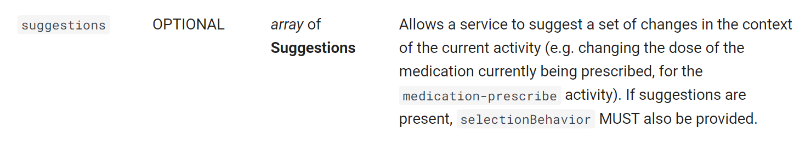
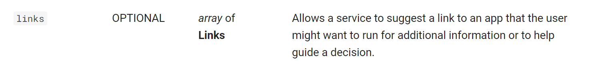
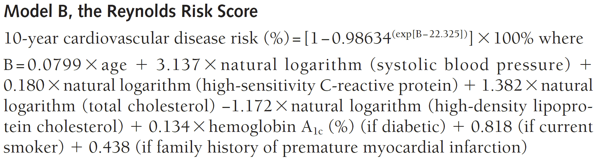

# Links, Suggestions, FHIR Queries \(in progress...\)

## What we'll be building

In this section, we'll be building a CDS service that calculates the Reynolds Risk score of a patient based on recent clinical observations. The service will return both a useful suggestion, and a link to a SMART app to further work with the information, based on the calculation. 

This service will also be invoked with the `patient-view` hook. 

### Reynolds risk score

As opposed to the previous two sections, the service we'll build in this section is tailor-made to provide useful decision support for a real-world issue. 

The [**Reynolds Risk Score**](http://www.reynoldsriskscore.org/) is a metric designed to predict someone's risk of having a future heart attack, stroke, or other major heart disease within the next 10 years. It uses different patient observations to make its assessment, including smoking status, systolic blood pressure, cholesterol levels, cigarette smoking status. 

The service we build will process the most recent patient observations in order to calculate this score. By some metric, the service will make suggestions to prescribe certain medications if the patients risk is high. Finally, the service will provide a link to a SMART app to further work with the support information that your service provided.

## Suggestions and links

We'll first take a closer look at the [attributes](https://cds-hooks.hl7.org/1.0/#card-attributes) of a `Card` from the CDS Hooks specification. There are attributes of CDS cards that can enhance a service's decision support that we haven't worked with yet. Two of those attributes are **suggestions** and **links.** 





### Suggestions and actions 

What if we wanted to provide more interactive decision support, such as suggesting the user read further into an issue, or even prescribe a medication? This is what **suggestions** are for.

Suggestions are described by three attributes.  Only the `label`property - a human-readable description of the action - is required. The following is an example of a suggestion with the `label` and `actions` properties.

```javascript
suggestions: [
          {
            label: "Create a prescription for Aspirin 80 MG oral Tablet",
            actions: [
              {
                type: "create",
                description:
                  "Create a prescription for Aspirin 80 MG Oral Tablet",
                resource: {
                  ...
                  // shortened for brevity
                  ...
                },
              },
            ],
            request: {
              method: "POST",
              url: "MedicationRequest",
            },
          },
        ],
```

**Actions** are actions that the user of the CDS client take when given a suggestion. In an interface that renders CDS cards, like Logica, actions will look like a button that, when pressed, will perform one of the three types of actions: `create`, `update`, and `delete`. If the type of action is `create` or `update`, the action must include the `resource` field that's populated by a FHIR resource to be provided so that the action can be taken. 

### Links

What if we wanted to provide links to external SMART apps or web pages? This is what **links** are for. 

Links come in two varieties. `absolute` links take the user to an external website, such as a reference page or a paper. `smart` links are used to launch external SMART applications. SMART applications are healthcare applications designed to use the [SMART on FHIR API](https://smarthealthit.org/about-smart-2/). Think of them as healthcare applications that we can launch from a `Card` when we need enhanced functionality to deal with present FHIR data.

Below is an example of an `absolute` link to google.com.

```javascript
links: [
          {
            label: "Google.com",
            url: "https://google.com",
            type: "absolute",
          },
        ],
```

Below is an example of a `smart` link to an external SMART app.

```javascript
links: [
          {
            label: "ASCVD Risk Calculator",
            url: "https://launch.smarthealthit.org/v/r2/login?client_id=my_web_app&response_type=code&scope=patient%2FPatient.read%20patient%2FObservation.read%20launch%20online_access%20openid%20profile&redirect_uri=https%3A%2F%2Fengineering.cerner.com%2Fascvd-risk-calculator%2F&state=7d85ba03-ff89-7ec6-d3e6-38bc844ba085&aud=&launch=eyJhIjoxLCJmIjpmYWxzZSwiZyI6ZmFsc2UsImQiOi0xfQ&provider=&login_type=provider&aud_validated=1",
            type: "smart",
          },
        ],
```

## The code

### Imports

In the `src` directory, create a folder called `suggestions-links-fhir`. `cd` into it and create a file called `prefetch-context.js`. You'll be using the `Service` and `Card` classes like in the prior two sections.

```javascript
import { Service, Card } from "@sero.run/sero";
```

### Options

This service is invoked on the `patient-view` hook like the previous two sections. Like the previous section, we'll use a prefetch template that fetches relevant information needed to determine the Reynolds risk score. 

```javascript
const options = {
  id: "suggestions-links",
  title: "patient view with Reynolds Risk Score assessment",
  hook: "patient-view",
  description:
    "Service triggered on the patient-view hook that calculates Reynolds risk score, and makes a MedicationPrescribe suggestion based on the result. Also provides a link to a SMART app to help work with the result",
  prefetch: {
    patient: "Patient/{{context.patientId}}",
    hscrp: "Observation?code=http://loinc.org|30522-7&_sort=date",
    cholesterolMassOverVolume: "Observation?code=http://loinc.org|2093-3&&_sort=date",
    hdl: "Observation?code=http://loinc.org|2085-9&_sort=date",
    bloodPressure: "Observation?code=http://loinc.org|55284-4&_sort=date",
  },
};
```

The prefetch template includes four FHIR path search queries for observations matching the loinc code in the search query. For example, to fetch all of the Observations where the patients blood pressure was measured, and sort by date, you use `Observation?code=http://loinc.org|55284-4&_sort=date`. 

This will return a `Patient` and four `Bundle` FHIR resources.

### Helper functions

To calculate the Reynolds risk score, you'll use the following formula.



Like the prior section, create `util.js` and copy in the following code. 

```javascript
/**
 *
 * @param hscrp - hscrp value
 * @param cholesterol - cholesterol value
 * @param hdlc - hdlc value
 * @param systolicBloodPressure - systolic blood pressure
 * @returns reynolds risk score - 10-year cardiovascular disease risk
 */
export function reynoldsRiskScore(
  age,
  systolicBloodPressure,
  hscrp,
  cholesterol,
  hdlc,
  hemoglobinA1c = 0,
  smoking = false,
  familyHistory = false
) {
  let B =
    0.0799 * age +
    3.317 * Math.log(systolicBloodPressure) +
    0.18 * Math.log(hscrp) +
    1.382 * Math.log(cholesterol) -
    1.172 * Math.log(hdlc);
  if (hemoglobinA1c != 0) B += 1.134;
  if (smoking == true) B += 0.818;
  if (familyHistory == true) B += 0.438;
  return (1 - Math.pow(0.98634, Math.exp(B - 22.325))) * 100;
}

/**
 *
 * @param patient - fhir Patient
 * @returns number, the patients age
 */
export function getAge(patient) {
  const ageDate = new Date(Date.now() - new Date(patient.birthDate).getTime());
  return Math.abs(ageDate.getUTCFullYear() - 1970);
}

/**
 *
 * @param value -
 * @returns the numerical value of the measurement. There are two components
 * to the blood pressure and we want the systolic blood pressure, or the
 * first item ([0])
 */
export function getBloodPressure(value) {
  return value.entry[0].resource.component[0].valueQuantity.value;
}

/**
 *
 * @param value - value we are trying to determine (hscrp, cholesterol, or Hdlc)
 * @returns
 */
export function getValue(value) {
  return value.entry[0].resource.valueQuantity.value;
}

export function getCholesterol(value) {
  return value.entry[0].resource.valueQuantity.value;
}

/**
 *
 * @param value -
 * @ returns the numerical value of the measurement
 */
export function getHdlc(value) {
  return value.entry[0].resource.valueQuantity.value;
}
```

These helper functions get the the necessary data from the request body to calculate the risk score, and then calculate the risk score directly. 

Import these functions into `suggestions-links-fhir.js`. 

```javascript
import {
  reynoldsRiskScore,
  getAge,
  getBloodPressure,
  getValue,
} from "./util.js";
```


