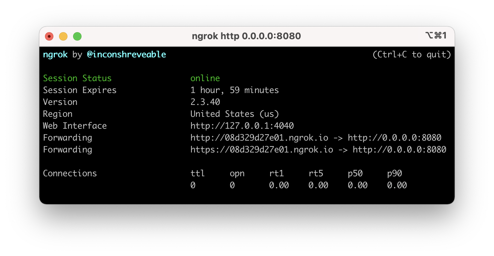
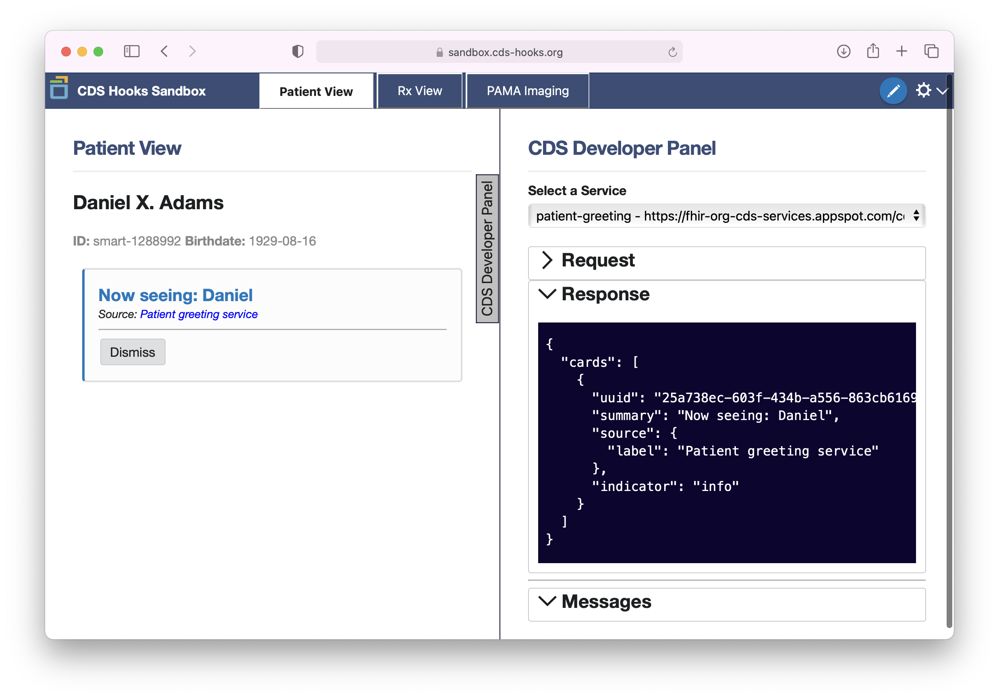
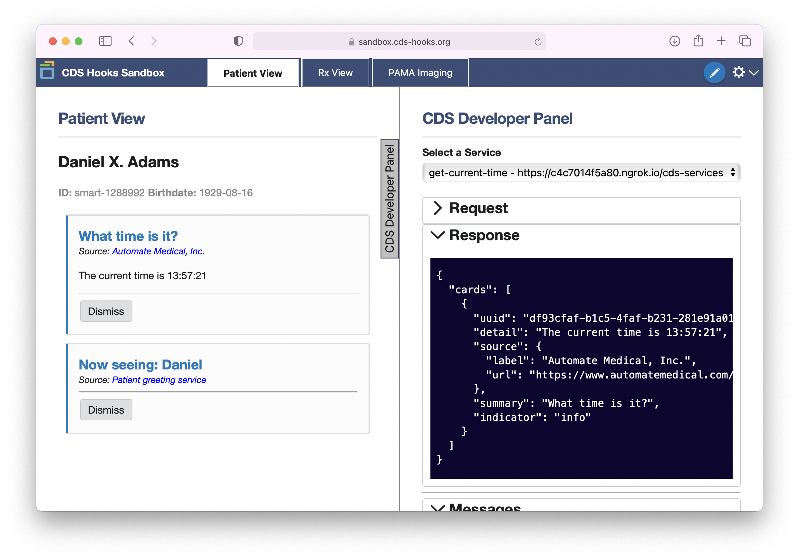

# Creating Our First Service

## What we'll be building

This Service is pretty simple: it will tell us the current time. More specifically, it will echo the current time back to the Client that makes a request for decision support.


You can find the complete source for this guide in the Sero project at [**example/cds-hooks-api-guide**](https://github.com/Automate-Medical/sero/tree/master/example/cds-hooks-api-guide)


## The code

### Imports  

In the `src` directory, create a folder called `current-time` then `cd` into it and create the file `get-current-time.js`.

Sero includes a `Service` class and a `Card` class. Import those at the top of the file:


```javascript
import { Service, Card } from "@sero.run/sero";
```


### Options

Every CDS service consists of two things: a **configurations option object**, and a **service handler**. The options object contains necessary and optional parameters for creating a CDS Service. 

Let's define the following options:


```javascript
const options = {
  id: "get-current-time",
  title: "Get the current time",
  hook: "patient-view",
  description: "This example shows how easy it is to make a CDS hooks service with Sero. This service responds with the current time after being invoked by the patient-view hook",
};
```


What do these options mean?

Every service that's made on our CDS Hooks API can be called by a CDS client making requests to `<server_url>/cds-services`. The `id` parameter is the unique identifier for a service. 

The title and description are a human-readable name and explanation of what the service does. They are required.

Lastly, this service will respond to the `patient-view` **Hook**. This is used to tell the a CDS client when to use this decision support \(in this case, when a patient record is being view\). Hooks also help us define data requirements, which we will cover in a later section.

Luckily, Sero configures this automatically for us. 


You can read more about the options available in the Sero reference guide for the CDS Hooks feature:




### Service handler

The Service handler is an `async` function that runs when a request is made from a Client to a Service. In this case, an HTTP GET request is sent to`/cds-services/get-current-time`.  The `id` we defined in the options above is what configures this url.

Let's add an empty handler to `get-current-time.js`


```javascript
const handler = async (request) => { };
```


Upon receiving a request, the handler will respond with a new `Card` displaying the current time. Let's expand our handler:


```javascript
const handler = async (request) => {
  const today = new Date();
  const minutes = today.getUTCMinutes();
  const time = `${today.getHours()}:${
    minutes <= 9 ? "0" : ""
  }${minutes}:${today.getSeconds()}`;
  return {
    cards: [
      new Card({
        source: {
          label: "Automate Medical, Inc.",
          url: "https://www.automatemedical.com/",
        },
        summary: `What time is it?`,
        detail: `The current time is ${time}`,
        indicator: "info",
      }),
    ],
  };
};
```


Our handler now returns an object with a new `Card` containing information about the current time. Not exactly ground-breaking decision support, but we need to start somewhere!

To round off `get-current-time.js`, let's add a default export:


```javascript
export default new Service(options, handler);
```


### Running the API

Head back to `index.js` and import the service.


```javascript
import { Http, CDSHooks, start } from "@sero.run/sero";

import compareTimeService from "./current-time/current-time.js";

const config = {
  cdsHooks: {
    services: [compareTimeService],
    cors: true,
  },
};

const http = Http(config);
CDSHooks(config, http);
start(http);
```


In order to run the node server locally, `package.json` needs a new script, as well the `type` key set to `module`. 


```javascript
{
  "name": "cds-hooks-api-guide",
  "version": "1.0.0",
  "description": "",
  "main": "index.js",
  "scripts": {
    "test": "echo \"Error: no test specified\" && exit 1",
    "start": "node src/index.js"
  },
  "author": "",
  "license": "ISC",
  "dependencies": {
    "@sero.run/sero": "^0.0.16"
  },
  "type": "module"
}
```



The latest version of Sero may be different than the version used in this walkthrough


The server can now be run with `npm run start`. 

## Testing

### Calling the API

For this part of the walkthrough, we'll be using the [**CDS Hooks sandbox**](http://sandbox.cds-hooks.org/) ****to make requests to our server. 

Although the server is running locally, we are unable to make requests to it because it is not connected to the internet. You are going to use a tunneling service - namely ngrok, to generate a public URL for the server so it can be seen by CDS clients to test our newly-created API.

### Configuring ngrok

First, create an [account](https://dashboard.ngrok.com/login) with ngrok. Go [through the short walkthrough](https://dashboard.ngrok.com/get-started/setup) that guides through basic installation and authentication. Launch ngrok and, with the server running, enter `ngrok http 0.0.0.0:8080`. The console should now provide a public `http` and `https` links for the server. 



### Launching the CDS Hooks Sandbox

Head to the [**CDS Hooks Sandbox**](http://sandbox.cds-hooks.org/). The sandbox simulates three example workflows and let's us test the Service as a Client.

You should see the Patient View workflow on your screen. On the left, we see a simulated EHR event \(viewing a patient record\). On the right, we see a debug panel showing the request/response lifecycle from the Service.



By default, the sandbox shows a default response to a `patient-view` hook invocation that returns a card with the text **Now seeing: Daniel.** You can see the Card rendering this information on the left.

Click on the gear in the top right and, in the dropdown, select "_Add CDS Services_."

Paste the public `https` link from ngrok into the input area. Append `/cds-services` to the end of the link, and click "_Save_." This is known as the "Discovery Endpoint" for our Service.

The CDS Hooks Sandbox will ask Sero for a list of Services in our Discovery Endpoint.



Our new Service, `get-current-time` returns a Card, now displayed on the left, with the current time.

Congratulations! We just built a CDS API with a simple CDS service. In the next section we'll learn more about CDS Hooks, how to deal with incoming requests, and how to work with FHIR Resources.

