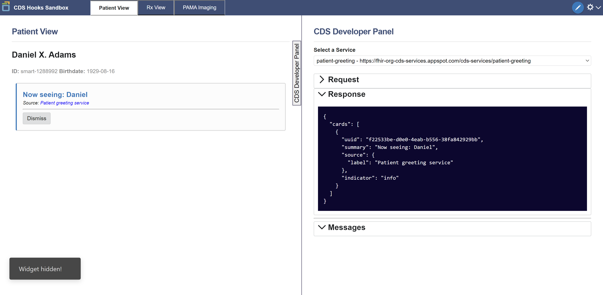
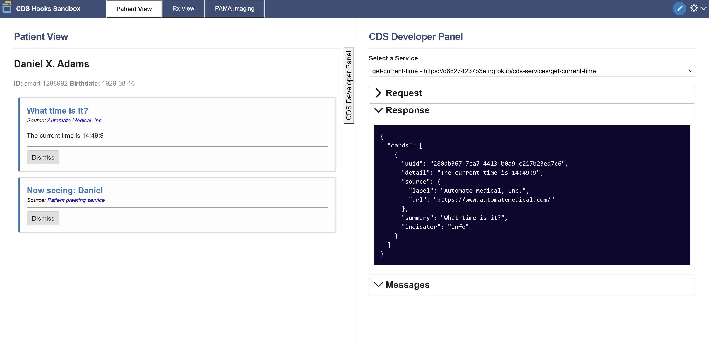

# Creating Your First Service

## Download starter code \(optional\)

If you’re NOT continuing from the previous lesson, you can download, install, and run the starter code for this lesson below. This sets up a `cds-hooks-api-guide` directory such that it’s identical to the result of the previous lesson.

Again, this is NOT necessary if you’ve just finished the previous lesson.

```bash
git clone (url-in-progress)
```

With this step you'll use Sero to make your first API, and make a request to it with the CDS Hooks sandbox.

## What you'll be building

In this section of the walkthrough, you'll be building your first CDS service. This service is pretty simple: it'll mirror the current time back to the client that made the request. 

## More on services and cards

The concept of card was introduced last time...

## The code

### Imports  

In the `src` directory, create a folder called `current-time` and after `cd`ing into it, create the file `get-current-time.js`. Sero includes a `Service` class and a `Card` class. Import those at the top of the file:

```javascript
import { Service, Card } from "@sero.run/sero";
```

### Options

Every CDS service consists of two things: a **configurations option object**, and a **service handler**. The options object contains necessary and optional parameters for setting up a CDS service. 

Our service will respond to the `patient-view` hook, or a workflow in which the user of the CDS client opens a patients medical record. Every service our server provides will be a part of the response to `<server_url>/cds-services`. The `id` parameter is the unique identifier for the service, and the description is a human-readable explanation of what the service does. 

```javascript
const options = {
  id: "get-current-time",
  title: "Get the current time",
  hook: "patient-view",
  description:
    "This example shows how easy it is to make a CDS hooks service with Sero. This service responds with the current time after being invoked by the patient-view hook",
};

```

### Service handler

The service handler is an `async` function that runs when an HTTP `request` is made to a service on your server \(in this case, `<server_url>/cds-services/get-current-time`\).  

```javascript
const handler = async (request) => {
    ...
};
```

Upon receiving a request, our handler can respond with a new `Card` displaying the current time. 

```javascript
const handler = async (request) => {
  const today = new Date();
  const minutes = today.getUTCMinutes();
  const time = `${today.getHours()}:${
    minutes <= 9 ? "0" : ""
  }${minutes}:${today.getSeconds()}`;
  return {
    cards: [
      new Card({
        source: {
          label: "Automate Medical, Inc.",
          url: "https://www.automatemedical.com/",
        },
        summary: `What time is it?`,
        detail: `The current time is ${time}`,
        indicator: "info",
      }),
    ],
  };
};
```

Lastly, instantiate our service and export it.

```javascript
export default new Service(options, handler);
```

## Deployment

### Calling our API

For this part of the walkthrough, you'll will be using the [CDS Hooks sandbox](http://sandbox.cds-hooks.org/) to make requests to our server. 

Run the server with `npm run start`. Although the server is running locally, you are unable to make requests to it because it is not connected to the internet. You are going to use a tunneling service - namely, ngrok, to generate a public URL for our server so it can be seen by CDS clients designed to test your application.

### Configuring ngrok

First either [log in or create an account](https://dashboard.ngrok.com/login) with ngrok. Next, go [through the short walkthrough](https://dashboard.ngrok.com/get-started/setup) that guids you through basic installation and authentication. Launch ngrok and, with our server running, enter `ngrok http 0.0.0.0:8080`. Your screen should now provide a public `http` and `https` links for our server. 


### Launching the CDS sandbox

Head to the [CDS-sandbox](http://sandbox.cds-hooks.org/). You should see the following screen.



By default, the sandbox shows a default response to a `patient-view` hook invocation that returns a card with the text **Now seeing: Daniel.** 

Click on the gear in the top right and, in the dropdown, select "Add CDS Services." Paste the public link from ngrok into the input area. Append `/cds-services` to the end of the link, and click "Save."

You should now see the following screen.



The sandbox is now aware of two `patient-view` hooks: the hook that was there by default, and the hook   that you just added. You should see two cards on the left, with the new card being the card displaying the current time in 24-hour format.

Congratulations! You just built a CDS API and created your first service. In the next section you'll learn about how to deal with data requests made to your server, and how to work with that data.

