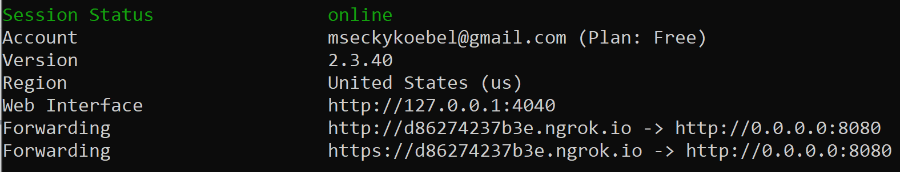

# Creating Our First Service

## What we'll be building

In this section of the walkthrough, we'll be building a basic CDS service. This service is pretty simple: it'll mirror the current time back to the client that made the request to it. 

## The code

### Imports  

In the `src` directory, create a folder called `current-time`. `cd` into it and create the file `get-current-time.js`. Sero includes a `Service` class and a `Card` class. Import those at the top of the file:

```javascript
import { Service, Card } from "@sero.run/sero";
```

### Options

Every CDS service consists of two things: a **configurations option object**, and a **service handler**. The options object contains necessary and optional parameters for setting up a CDS service. 

This service will respond to the `patient-view` hook. In other words, it will respond to a workflow in which the user of the CDS client opens a patient's medical record. 

Every service that's made on our CDS Hooks API can be called by a CDS client making requests to `<server_url>/cds-services`. The `id` parameter is the unique identifier for a service. The description is a human-readable explanation of what the service does. It is required in the CDS Hooks specification. Luckily, Sero configures this automatically for us. 

```javascript
const options = {
  id: "get-current-time",
  title: "Get the current time",
  hook: "patient-view",
  description:
    "This example shows how easy it is to make a CDS hooks service with Sero. This service responds with the current time after being invoked by the patient-view hook",
};

```

### Service handler

The service handler is an `async` function that runs when an HTTP `request` is made to a service on the server \(in this case, `<server_url>/cds-services/get-current-time`\).  

```javascript
const handler = async (request) => {
    ...
};
```

Upon receiving a request, the handler can respond with a new `Card` displaying the current time. 

```javascript
const handler = async (request) => {
  const today = new Date();
  const minutes = today.getUTCMinutes();
  const time = `${today.getHours()}:${
    minutes <= 9 ? "0" : ""
  }${minutes}:${today.getSeconds()}`;
  return {
    cards: [
      new Card({
        source: {
          label: "Automate Medical, Inc.",
          url: "https://www.automatemedical.com/",
        },
        summary: `What time is it?`,
        detail: `The current time is ${time}`,
        indicator: "info",
      }),
    ],
  };
};
```

Lastly, instantiate the service and export it.

```javascript
export default new Service(options, handler);
```

## Deployment

### Calling our API

For this part of the walkthrough, we'll be using the [CDS Hooks sandbox](http://sandbox.cds-hooks.org/) to make requests to our server. 

Run the server with `npm run start`. Although the server is running locally, we are unable to make requests to it because it is not connected to the internet. You are going to use a tunneling service - namely ngrok, to generate a public URL for the server so it can be seen by CDS clients to test our newly-created API.

### Configuring ngrok

First, create an [account](https://dashboard.ngrok.com/login) with ngrok. Go [through the short walkthrough](https://dashboard.ngrok.com/get-started/setup) that guides through basic installation and authentication. Launch ngrok and, with the server running, enter `ngrok http 0.0.0.0:8080`. The console should now provide a public `http` and `https` links for the server. 



### Launching the CDS sandbox

Head to the [CDS-sandbox](http://sandbox.cds-hooks.org/). You should see the following screen.


By default, the sandbox shows a default response to a `patient-view` hook invocation that returns a card with the text **Now seeing: Daniel.** 

Click on the gear in the top right and, in the dropdown, select "Add CDS Services." Paste the public `https` link from ngrok into the input area. Append `/cds-services` to the end of the link, and click "Save."

You should now see the following screen.


The sandbox is now aware of two `patient-view` hooks: the hook that was there by default, and the hook we created. We should see two cards on the left, with one of the cards displaying the current time in 24-hour format.

Congratulations! We just built a CDS API with a simple CDS service. In the next section we'll learn more about CDS Hooks, how to deal with incoming requests, and how to work with FHIR data. 

