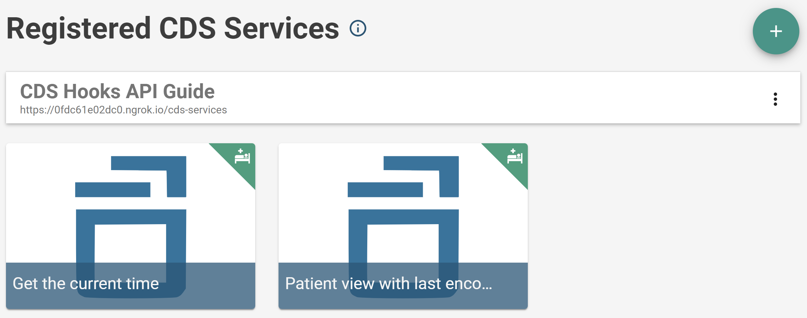
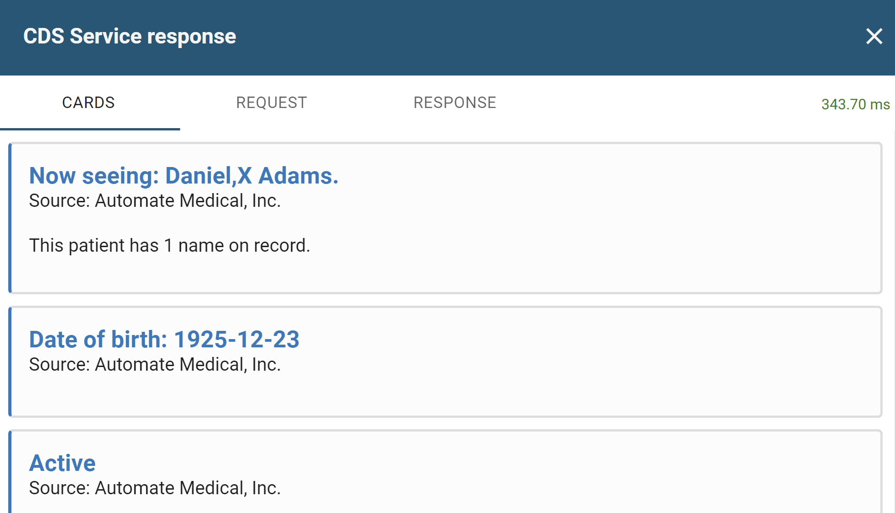

# Prefetch and Context

## Download starter code \(optional\)

If you’re NOT continuing from the previous lesson, you can download, install, and run the starter code for this lesson below. This sets up a `cds-hooks-api-guide` directory such that it’s identical to the result of the previous lesson.

Again, this is NOT necessary if you’ve just finished the previous lesson.

```bash
git clone (sero-example-repo-url-here)
```

## What you'll be building

In this section, you'll be building a CDS service that receives a request to display demographic information about a patient being viewed by the CDS client. The service will determine if the last encounter date of the patient based on their encounter history, and suggest that an appointment be booked again if it has been too long since their last appointment. 

This service will also be invoked with the `patient-view` hook.

## Prefetch and Context

In the previous example, the service you made didn't require accessing the HTTP `request` body. Although this is not necessary to make a response to a request, services that compute useful recommendations need to access the **contextual** information in the request, and request more **FHIR** data if needed through **prefetch templates**. 

### Context

If you create a CDS Hook \(`patient-view`, `appointment-book`, `encounter-start`, etc.\), for your service to work properly, the CDS client needs to provide important contextual information to your service to work properly. This information is a pre-defined agreement specified by CDS Hooks that guarantees that this information will be provided by the CDS client. 

For example, if you head over to the [specification](https://cds-hooks.org/hooks/patient-view/#context) for the `patient-view` hook \(which we are using in this walkthrough\), you can see that there are required keys that need to be provided to the CDS service upon a hook request. In this example, `userId` and `patientId` are required, and `encounterId` is optional. This is because to perform useful actions for this hook, your service needs to know the current patient whose record is being viewed, the user who is viewing the record, and we only _might_ need to know the identity of the current encounter. For this example we won't.

In general, it is implied that the CDS client, as a consumer of a service, will send the required values to the service to which it is making a request. As a developer of CDS services, you do not need to worry about providing any additional parameters for context. 

If needed, you could retrieve it from the request body \(although it is not required for this walkthrough\). 

```javascript
const handler = async (request) => {
    const contextData = request.context;
}
```

### Prefetch and prefetch template

What if you need additional information from a FHIR database in order to respond to a request? To serve complex requests, it is likely you will.

A **prefetch template** is an object containing FHIR queries that your service defines when it needs additional information from the CDS client. When present, the CDS client executes FHIR path queries and includes this FHIR data in the request body. 

For example, the CDS client only provides basic contextual information by default. For the `patient-view` hook, this is only the `userId` and `patientId`. If your service wanted to recommend guidance based on a patients condition when this hook is invoked, you would use a **prefetch token**, or a FHIR query, to fetch this information. Below is the prefetch token that would accomplish this.

```javascript
"patient": "Patient/{{context.patientId}}",
```

This is what the prefetch template would look like.

```javascript
"prefetch": {
    "patient": "Patient/{{context.patientId}}",
  }
```

To retrieve this prefetch data in the request body, you would assign it to a variable matching the name of the key associated with the query.

```javascript
const patient = request.prefetch.patient;
```

`patient` is now a FHIR patient resource. 

The context values the hook provides are used in the prefetch template. For the example above, the `patientId` context value is used to execute the FHIR query on the client. The hook specifies which context values can be used in prefetch tokens. 

In general, as a developer of a CDS hook, you should use prefetch templates whenever additional information is needed to perform. They are, however, optional parameters and might not be required to perform some actions, such as respond to the current time or fetch information from an external API.

### Summary

When a CDS client consumes your service, it knows to send important contextual information to the service. This depends on the hook, but expect the client to send these values. 

If your service needs extra information from the client in order to perform a task, you provide a pre-fetch template when configuring your service. When a CDS client goes to make a request to your service, it knows to take the prefetch template, execute the FHIR path queries on its FHIR data source, and return a prefetch object whose keys match the keys of the request. It is common that context fields such as `context.patientId` will be needed to execute these searches - they can be accessed with the double-handlebars syntax, `{{ context.patientId}}`. 

## The code

### Imports

In the `src` directory, create a folder called `prefetch-context`. `cd` into it and create the file `prefetch-context.js`.  Import the `Service` and `Class` classes like last time. 

```javascript
import { Service, Card } from "@sero.run/sero";
```

### Options

The service's configuration options will look roughly the same as the previous services, excluding the modified `title`and  `description`, and added `prefetch` template.

```javascript
const options = {
  id: "prefetch-context",
  title: "Patient view with last encounter.",
  hook: "patient-view",
  description:
    "A patient-view hook with patient and encounter prefetch template values. Presents patient info and last encounter information",
  prefetch: {
    patient: "Patient/{{context.patientId}}",
    encounter: "Encounter?subject={{context.patientId}}&_sort=date",
  },
};
```

The prefetch template includes two keys: `patient`, and `encounter`. `patient` calls for the client to execute a query to fetch the Patients resources. This is a type of FHIR resource \(more on this [here](https://www.hl7.org/fhir/patient.html)\). `Encounter` will return a set of `Encounter` resources sorted by date. This is another kind of FHIR resource \(more on this [here](https://www.hl7.org/fhir/encounter.html)\). 

This will return a FHIR `Patient` and `Bundle` resource respectively. 

### Helper functions

To process the patient's demographic information, such as their name and contact information, make a new file called `util.js` and copy the following code into it. For the purpose of this walkthrough, you can assume all of this information will be included in the patient FHIR resource \(although this is not guaranteed\).

```javascript
/**
 *
 * @param patient - a fhir patient
 * @returns an array of fhir human names
 * Return an array of patient names from the fhir patient bundle
 */
export function processPatientNames(patient) {
  const patientNames = [];
  patient.name?.forEach((name) => {
    patientNames.push(name);
  });
  return patientNames;
}

/**
 *
 * @param patient - a fhir patient
 * @returns an array of fhir addresses
 * Return an array of addresses from the fhir patient bundle
 */
export function processAddresses(patient) {
  const addresses = [];
  patient.address?.forEach((address) => {
    addresses.push(address);
  });
  return addresses;
}

/**
 *
 * @param patient - a fhir patient
 * @returns an array of fhir contacts
 * Return an array of contacts from the fhir patient bundle
 */
export function processContacts(patient) {
  const contacts = [];
  patient.contact?.forEach((address) => {
    contacts.push(address);
  });
  return contacts;
}

/**
 *
 * @param patient - a fhir patient
 * @returns an array of fhir contact points
 * Return an array of contact points (email and other things) from the fhir patient bundle
 */
export function processTelecom(patient) {
  const telecom = [];
  patient.telecom?.forEach((address) => {
    telecom.push(address);
  });
  return telecom;
}

/**
 *
 * @param encounter
 * @returns an array of FHIR encounter bundles (@todo, no explicit any)
 */
export function processEncounters(encounter) {
  const encounters = [];
  encounter.entry?.forEach((entry) => {
    encounters.push(entry);
  });
  return encounters;
}

/**
 *
 * @param encounter
 * @param daysWithoutAppointment
 * @returns boolean value. If the time difference is beyond the entered threshold,
 * true is returned, o/w false
 */
export function newAppointment(encounter, daysWithoutAppointment) {
  const encounterData = processEncounters(encounter);
  // find most recent and compare it to the current date
  const currentDate = new Date();
  const lastVisit = new Date(encounterData.pop().resource.period.start);
  const timeDifference = currentDate.getTime() - lastVisit.getTime();
  const differenceInDays = Math.floor(timeDifference / (1000 * 3600 * 24));
  if (differenceInDays > daysWithoutAppointment)
    return [true, differenceInDays];
  return [false, differenceInDays];
}

/**
 *
 * @param patient
 * @returns an array of identifiers for the patient
 */
export function getUuid(patient) {
  const identifiers = [];
  patient.identifier?.forEach((entry) => {
    identifiers.push(entry);
  });
  return identifiers;
}

```

Import these functions into `prefetch-context.js`. 

```javascript
import {
  processAddresses,
  processPatientNames,
  processTelecom,
  processEncounters,
  newAppointment,
} from "./util.js";
```

### Service handler

You can access the `patient` resource and the `encounter` resource in the request body. 

```javascript
const handler = async (request) => {
  const data = request.prefetch;
  const patientNames = processPatientNames(data.patient);
  const addresses = processAddresses(data.patient);
  const telecom = processTelecom(data.patient);
  const encounters = processEncounters(data.encounter);
  const newApp = newAppointment(data.encounter, 100);
}
```

Your service will return a card for every individual piece of demographic information. In addition to this, two cards will be returned that convey the total number of encounters on record assigned to the patient, and if the patient needs to book a new appointment based on the date of the last appointment. This is done in the `lastAppointment()` function. The function returns yes or no depending on the difference between the most recent encounter and the present date in number of days. The function sets the number of days to be 100 by default.

```javascript
return {
    cards: [
      // Name (only first name available)
      new Card({
        detail: `This patient has ${patientNames.length} name${
          patientNames.length <= 1 ? "" : "s"
        } on record.`,
        source: {
          label: "Automate Medical, Inc.",
          url: "https://www.automatemedical.com/",
        },
        summary: `Now seeing: ${patientNames[0].given} ${patientNames[0].family}.`,
        indicator: "info",
      }),
      // DOB
      new Card({
        source: {
          label: "Automate Medical, Inc.",
          url: "https://www.automatemedical.com/",
        },
        summary: `Date of birth: ${data.patient.birthDate}`,
        indicator: "info",
      }),
      // If the patient is active in the system
      new Card({
        detail: `${data.patient.active === true ? "Yes" : "No"}`,
        source: {
          label: "Automate Medical, Inc.",
          url: "https://www.automatemedical.com/",
        },
        summary: `Active`,
        indicator: "info",
      }),
      // Address (only first address available)
      new Card({
        detail: `${addresses[0].line}, ${addresses[0].city}, ${addresses[0].state} ${addresses[0].postalCode}`,
        source: {
          label: "Automate Medical, Inc.",
          url: "https://www.automatemedical.com/",
        },
        summary: `Current Address`,
        indicator: "info",
      }),
      // Gender
      new Card({
        detail: `${data.patient.gender}`,
        source: {
          label: "Automate Medical, Inc.",
          url: "https://www.automatemedical.com/",
        },
        summary: `Gender`,
        indicator: "info",
      }),
      // Telecom (only first piece of contact information available)
      new Card({
        detail: `${telecom[0].value}`,
        source: {
          label: "Automate Medical, Inc.",
          url: "https://www.automatemedical.com/",
        },
        summary: `Contact`,
        indicator: "info",
      }),
      // Information on the last encounter
      new Card({
        detail: `Last visit was on ${
          encounters.pop().resource.period.start
        }. There are ${encounters.length} encounter${
          encounters.length <= 1 ? "" : "s"
        } on record.`,
        source: {
          label: "Automate Medical, Inc.",
          url: "https://www.automatemedical.com/",
        },
        summary: `Last visit`,
        indicator: "info",
      }),
      // Seeing the last encounter information
      new Card({
        detail: `Make a new appointment? ${
          newApp[0] === true ? "Yes" : "No"
        }, last appointment was ${newApp[1]} day${
          newApp[1] > 1 ? "s" : ""
        } ago.`,
        source: {
          label: "Automate Medical, Inc.",
          url: "https://www.automatemedical.com/",
        },
        summary: `Book new appointment`,
        indicator: "info",
      }),
    ],
  };
```

Finally, export the service.

```javascript
export default new Service(options, handler);
```

## Deployment

### Logica Sandbox

The [Logica sandbox](https://sandbox.logicahealth.org/) is a service created by [Logica](https://www.logicahealth.org/solutions/fhir-sandbox/) that's useful for developing and testing FHIR applications. For this walkthrough, you are going to take advantage of Logica's ability to act as a CDS client. As opposed to the CDS sandbox that you used in the previous example, the Logica sandbox provides access to richer patient information, custom data sources and EHRs, and support for . These are just some of the services the sandbox offers but are the features we will be using for this walkthrough. 

### Configuring Logica

Head to the Logica sandbox. After creating an account, select the "NEW SANDBOX" button in the "My Sandboxes" section. 

Enter the following information, and select "CREATE."


Be sure to select FHIR R4, as selecting another version of FHIR will configure Logica differently. You should now see the Logica dashboard.


If you are not continuing this walkthrough directly from the previous section, it is likely you no longer have ngrok running. Launch ngrok again and enter the command `ngrok http 0.0.0.0:8080` like last time. The public URL will change each time this command is run so be sure to account for that when making requests. 

On the left sidebar, select "CDS Hooks." This is where you'll add your public URL. Select the "+" in the top-right corner. Fill out the form with the following information.


You should now see a screen that looks similar to this one.



### Calling your API

When you register CDS services with Logica, all of the CDS services available at the provided link are listed. The preview shows two services: the service you made in the previous section that fetches the current time, and the service that you made in this section.

Hover over the "Patient view with last encounter" service, and select "Launch." You should be prompted to select a practitioner. Logica simulates a scenario in which this hook would be called - in this case, a doctor named "Susan A. Clark" is the user of the CDS client will be viewing the profile of a patient in the client's database. After selecting Susan, click on the top patient, Adams, Daniel X, in the list of patients. 

Logica then makes a request to your service and, after some time, responds with a list of cards.



Logica, because it is a registered CDS client, sends along the info necessary for you to define prefetch values. If you scroll down some more you should see a card that says the date of the last encounter. 


Congratulations! You learned how to use context values provided by a CDS client to request additional information from the client to provide more advanced decision support. In the next section, you'll learn how to provide more advanced support through cards, and perform more advanced FHIR queries. 

### Bonus: request and response bodies

Logica lets you view the request and the response bodies whenever a request is made to a service. You can paginate over to them on the cards results page. 

If you take a closer look at the `util.js` file that was provided, you can get a better idea for how to work with FHIR request bundles, and potentially how to handle cases in which data may or may not be present.

